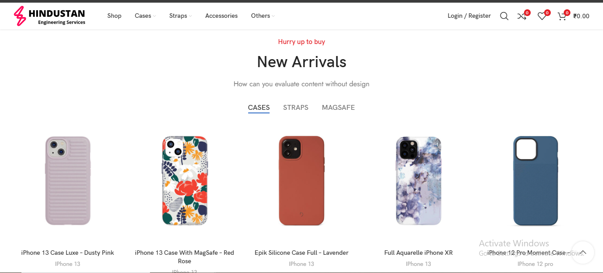
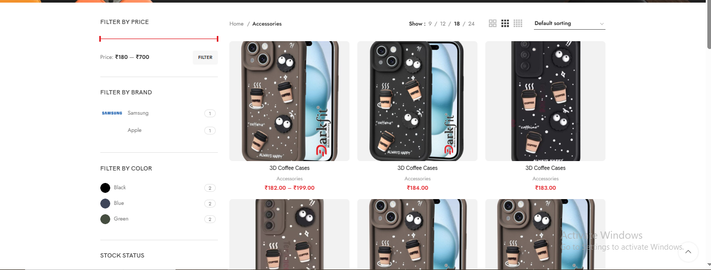
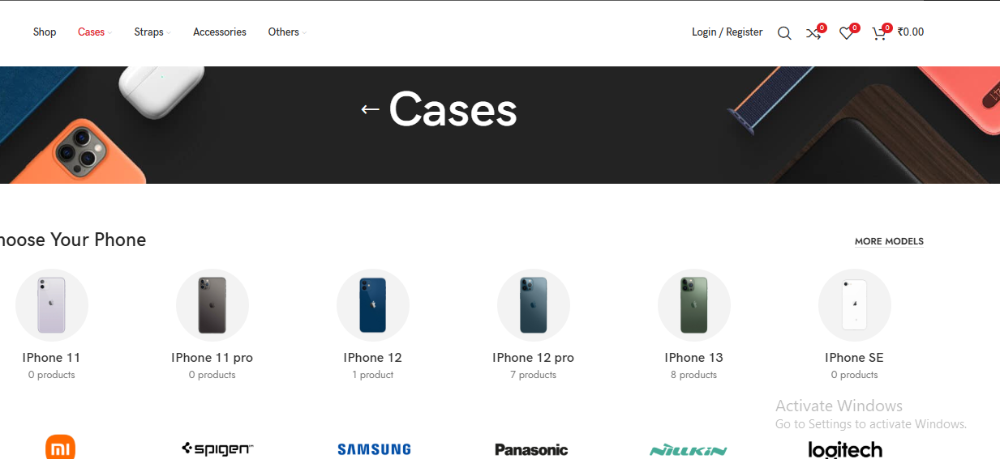
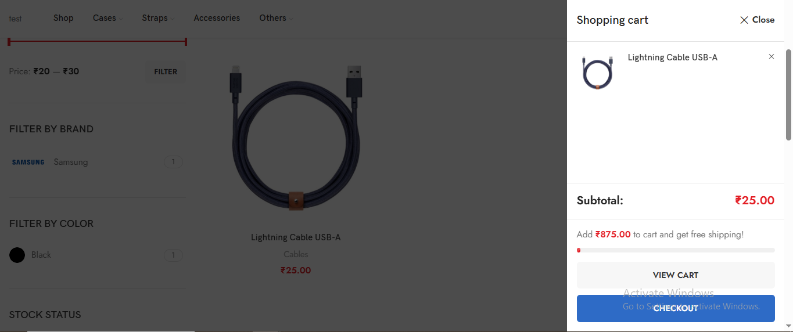
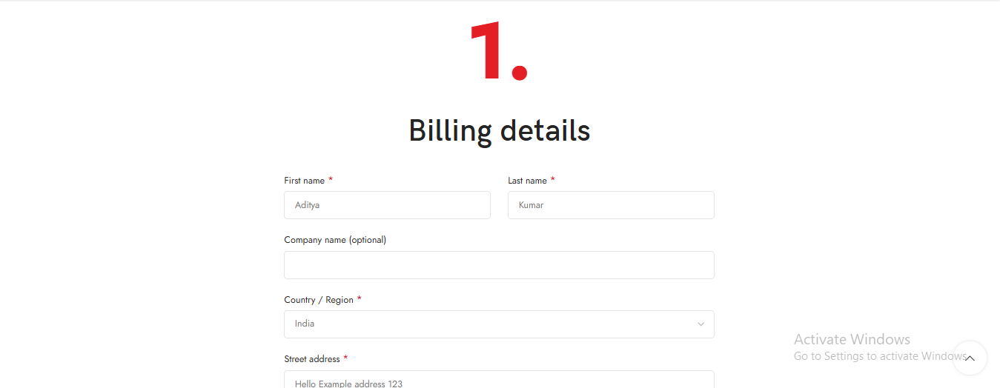
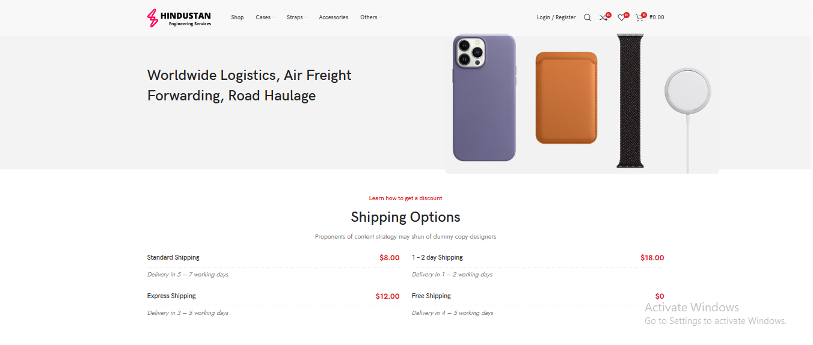
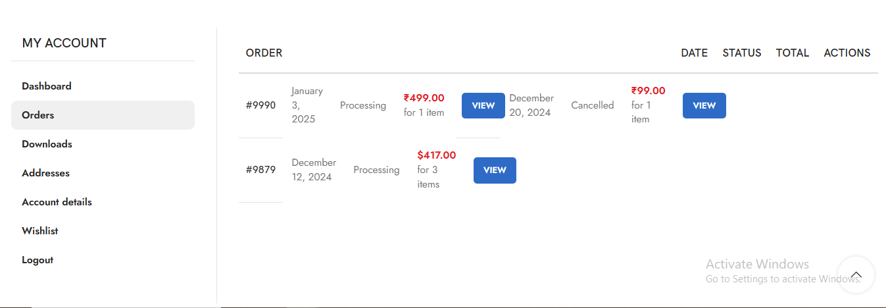
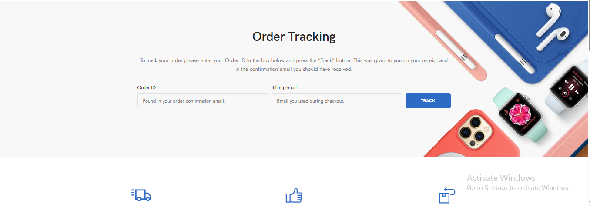

🛒 HEServices E-Commerce Website

🔗 Live Website: https://ecom.heservices.in/

📱 Fully Mobile Responsive
🛍️ Built with WordPress

    📌 Project Overview
        The HEServices E-Commerce Platform is a fully responsive online shopping website developed using WordPress.
        It enables customers to browse products add them to cart and complete purchases through a seamless and user-friendly interface. 
        The website is optimized for:
            - Desktop
            - Tablet
            - Mobile Devices
        It ensures a smooth shopping experience across all screen sizes.

    🧠 Core Features

      🛍️ Product Management
          - Product listing with categories
          - Product detail pages
          - Featured & latest products
          - Image gallery support
          - Price display & discount handling

      🛒 Shopping Cart System
          - Add to cart
          - Remove items
          - Quantity management
          - Auto price calculation
          - Dynamic cart updates
        
      💳 Checkout & Orders
          - Secure checkout page
          - Billing & shipping information
          - Order confirmation
          - Customer order tracking
    
      👤 User Account System
          - Customer registration
          - Secure login/logout
          - Order history
          - Account management
    
      📱 Mobile Responsive Design
          - Fully optimized for smartphones
          - Tablet friendly layout
          - Responsive product grid
          - Mobile navigation menu
          - Optimized checkout for small screens
          - The layout adapts dynamically to all device sizes using responsive design principles.
    
      🛠️ Tech Stack
          🌐 Platform
              - WordPress CMS
              - 🛒 E-Commerce
              - WooCommerce
    
          🎨 Frontend
              - HTML5
              - CSS3
              - JavaScript
              - Responsive Design
    
          🗄️ Database
              - MySQL
    
          🌍 Hosting & Deployment
              - Live Production Hosting
              - Domain Configuration
              - SSL Secured Website

      🎯 Key Highlights
        ✔ WordPress-based scalable architecture
        ✔ WooCommerce-powered online store
        ✔ Mobile responsive design
        ✔ Secure checkout process
        ✔ Easy product & order management
        ✔ SEO-friendly structure

📸 Screenshots (See Below)

### 🏠 Home Page

### 🛍️ Product Listing

### 🛒 Cart Page

### 💳 Checkout Page

### 💳 Shipping Page

### 💳 Orders Page

### 💳 Order Tracking Page

🔒 Source Code: Private repository. Available upon request.
